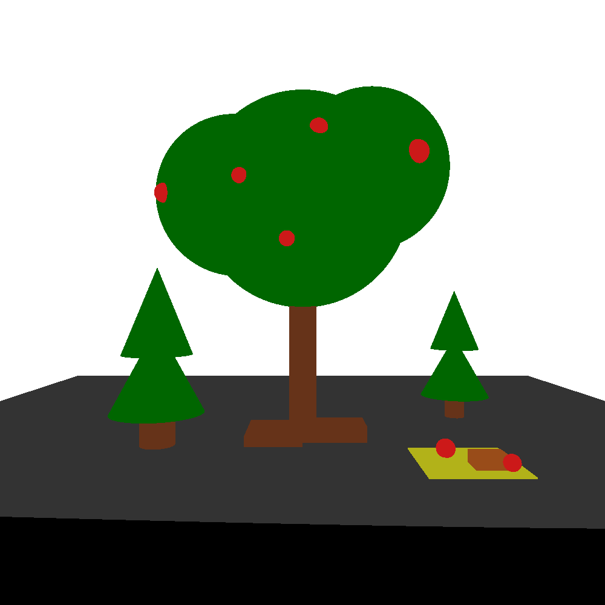

# Raytracer
This program is a custom raytracer implemented in C++ using vecor math and OpenGL that renders 3D scenes defined by scenegraphs. 

## Features
- Scenegraph-based hierarchical modeling
    - Includes object transformation, light translation, and custom object materials
- Support for primitives: box, sphere, cylinder, and cone
- Box and sphere texturing using ppm images
- Lighting and shadows
- Transparency
- Reflections

## How to Use
In the console, navigate to the src folder and enter the following commands.
```
mingw32-make clean
mingw32-make
./Scene
[scenegraph_file_name.txt]
```
When the viewport is visible, press the `S` key to ray trace the current OpenGL viewport. The final image will be saved as `raytraced_scene.ppm` in the `src/images` folder.

## Gallery 
### OpenGL Preview


### Final Ray Traced Image


### Textures Used
- Sky - https://www.turbosquid.com/3d-models/3d-model-toonstyle-skydomeskybox-1098294
- Ground/Leaves - Custom made

## Contributers
Meredith Scott & Thomas Yi

Starter code provided by Professor Amit Shesh.
